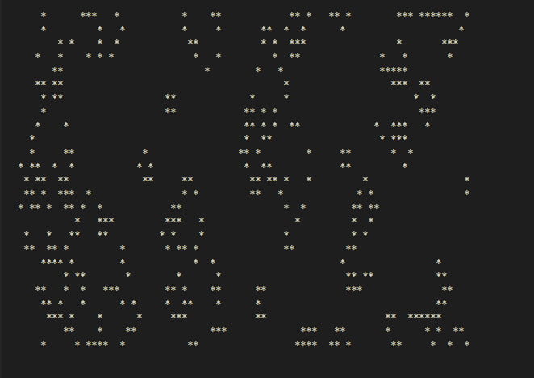
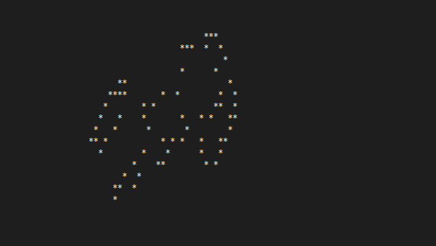
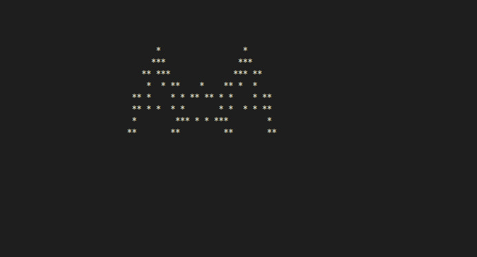
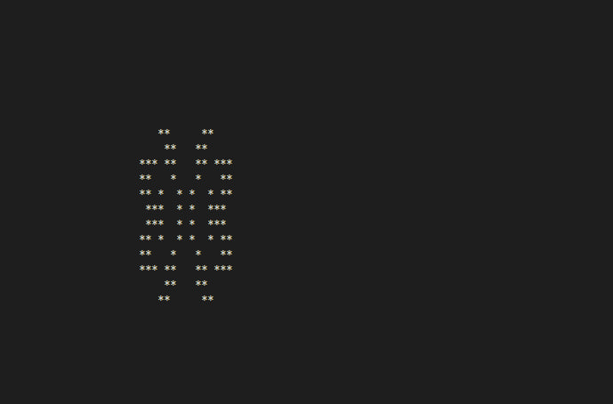
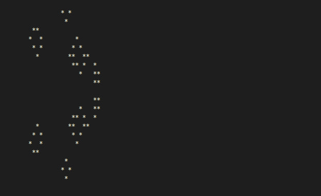

# Game of Life in C with ncurses
### Pet Project (Summer 2024)

This repository contains a classic implementation Game of Life in C using the ncurses library. The game features allows you to interact with the simulation via keyboard inputs.

## Description

Conway's Game of Life is a cellular automaton devised by mathematician John Conway. The game consists of a grid of cells that evolve through generations based on the following rules:

1. **Any live cell with two or three live neighbors survives.**
2. **Any dead cell with exactly three live neighbors becomes a live cell.**
3. **All other live cells die in the next generation. Similarly, all other dead cells remain dead.**

The implementation in this project uses the ncurses library to create a simple terminal-based visualization of the game.

## Features
- **Keyboard controls**:
  - `r`: Randomly generate the initial state of the grid.
  - `c`: Clear the grid.
  - `+`: Increase the speed of the simulation.
  - `-`: Decrease the speed of the simulation.
  - `q`: Exit the game.
- **Grid visualization**: Live cells are represented by `*`, and dead cells are represented by spaces.
- **Simulation updates**: The game updates the grid in real-time based on Conway's rules.

## Usage

1. **Clone the repository**:
    ```bash
    git clone https://github.com/your_username/your_repository.git
    ```

2. **Navigate to the project directory**:
    ```bash
    cd your_repository
    ```

3. **Compile the game**:
    ```bash
    gcc game_of_life.c -lncurses -o game_of_life 
    ```

4. **Run the game**: The game expects input from standard input. You can use the following command to start the game with an initial state read from text files (If this method is not suitable, then the data should be passed through the standard input stream):
    ```bash
    cat *.txt | ./game_of_life < /dev/tty
    ```

5. **Play the game**

6. **Makefile comands**:
    ```bash
    all
    clean
    format
    ```
## Screenshots

### Random generation

### Pattern 1

### Pattern 2

### Pattern 4

### Pattern 6


## File structure

- `game_of_life.c`: Main source code file for the game.
- `Makefile`: Build script for compiling the game.
- `.clang-format`: Code formatting configuration file.
- `materials/`: Directory containing screenshots and other assets.
- `pattern_*.txt`: Pattern files. 
- `README.md`: This file.

## Dependencies

- **ncurses**: A library for terminal handling that must be installed on your system. It can usually be installed via your package manager